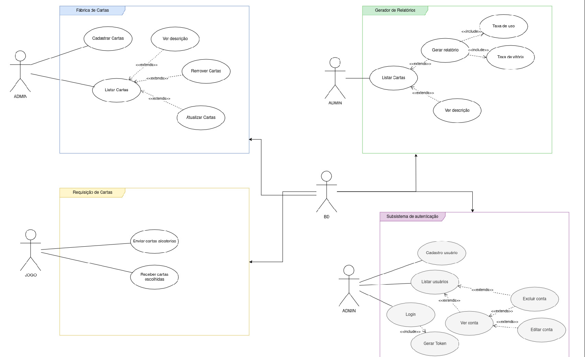
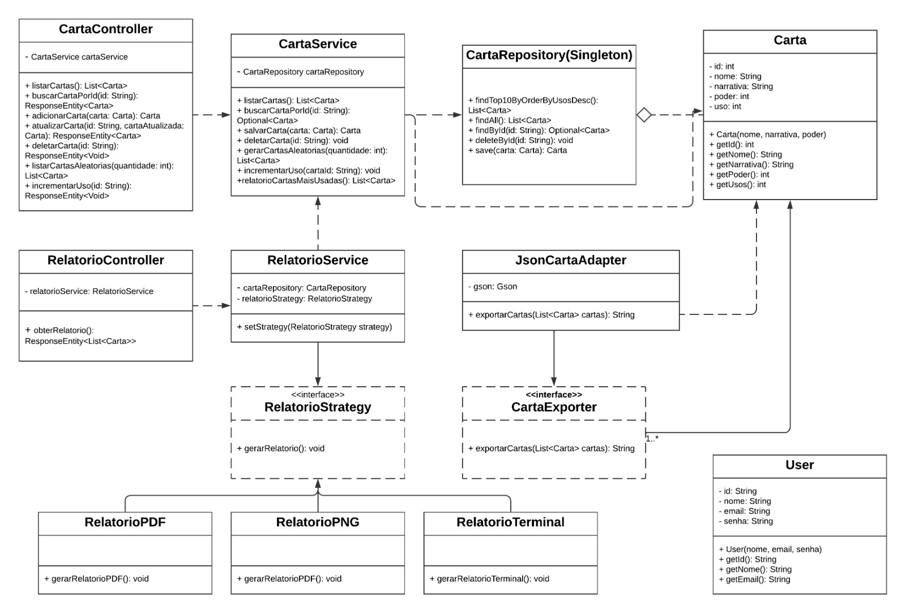

# Controle de Cartas

## Descrição
Usada pelos administradores do jogo e deve permitir o cadastro de cartas (definindo o valor de poder e narrativa1), além de permitir a atualização dos valores e remoção de cartas cadastradas. A aplicação enviar cartas aleatórias sempre que requisitado e receber quais quartas foram escolhidas. É esperado que a aplicação possa gerar relatórios de cartas mais usadas.
1 - descrição da carta (por exemplo, numa possível carta do José Nogueira Leite a narrativa poderia ser “Fundador do Inatel.”.)

## Tecnologias Utilizadas

O projeto foi desenvolvido utilizando as seguintes tecnologias:
- **Java**: Linguagem de programação principal usada no desenvolvimento da aplicação.
- **Spring Framework**: Framework utilizado para criar o projeto seguindo o padrão MVC(Model-View-Controller), além de gerenciar a injeção de dependências e facilitar a criação de APIs REST para a integração com os outros grupos.

## Diagramas
### Diagrama de caso de uso

### Diagrama de classes

## Design Patterns

### Strategy
Foi implementado o Design Pattern **Strategy** para definir diferentes estratégias de geração de relatórios. Isso permite que novas formas de gerar relatórios sejam facilmente adicionadas sem modificar o código existente.

#### Estratégias Disponíveis
- **Relatório em PDF**: Gera o relatório em formato PDF.
- **Relatório em PNG**: Gera o relatório como uma imagem PNG.
- **Relatório no Terminal**: Exibe o relatório diretamente no terminal.
#### Benefícios
- **Flexibilidade**: Permite adicionar novas estratégias de geração de relatórios sem alterar o código existente.
- **Manutenção**: Reduz o acoplamento entre a lógica de geração de relatórios e a classe de serviço.

### Adapter
Implementado o Design Pattern **Adapter** pensando na facilidade de comunicação com os outros projetos. Permitindo que seja possível a conversa entre o nosso software com o software das outras equipes, principalmente no momento em que enviamos as cartas aleatórias para o jogoador escolher.

#### Benefícios
- **Responsabilidade Única**: Separação da lógica de negócio com a conversão dos dados.
- **Princípio Open/Closed**: Podendo criar novos adapters sem a necessidade de mexer no código existente.

### Singleton
Garatindo uma única instância do banco de dados para que não ocorra conflitos e a integridade dos dados seja garantida.

#### Benefícios
- **Recurso economizado**: A instância desejada será criada só quando necessária, evitando objetos indesejados consumindo memória.
- **Segurança**: Certeza de existir apenas uma instância do banco de dados garante a segurança dos dados ao serem atualizados.

## Responsabilidades das Classes
| Classe                  | Responsabilidade                                                                 |
|-------------------------|----------------------------------------------------------------------------------|
| **CartaController**     | - Controla as requisições do usuário relacionadas às cartas.                     |
|                         | - Interage com o `CartaService` para processar a lógica de negócio.              |
| **CartaService**        | - Contém a lógica de negócio associada à classe `Carta`.                         |
|                         | - Usa o `CartaRepository` para acessar ou modificar os dados persistidos.        |
| **CartaRepository**     | - Responsável pelo acesso a dados (banco de dados, arquivos, etc.).              |
|                         | - Manipula instâncias da classe `Carta`.                                         |
| **Carta**               | - Representa o modelo ou entidade.                                               |
|                         | - Contém os atributos e métodos diretamente relacionados à carta.                |
| **RelatorioController** | - Controla as requisições do usuário relacionadas aos relatórios.                |
|                         | - Interage com o `RelatorioService` para gerar relatórios.                       |
| **RelatorioService**    | - Contém a lógica de negócio para gerar relatórios.                              |
|                         | - Obtém informações do `CartaService` e/ou `CartaRepository` sobre as cartas.    |
